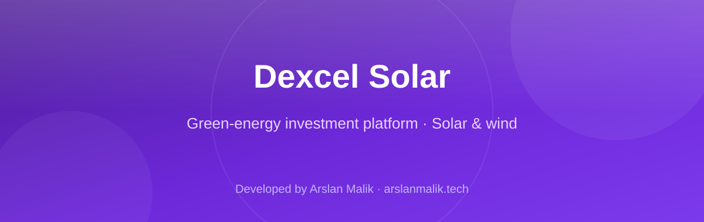
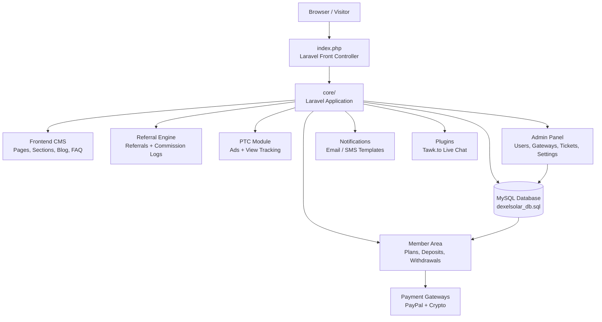

<p align="center">
  
</p>

<p align="center">
  
  
  
  
  
  
</p>

> **Developed by [Arslan Malik](https://github.com/arsalanmaalik461)**
> 📱 WhatsApp: [+92 300 8987448](https://wa.me/923008987448) · 🌐 Website: [arslanmalik.tech](https://arslanmalik.tech)

---

## 🌟 Executive Overview

**Dexcel Solar** is a Laravel-based web platform for a green-energy investment business. The concept behind the platform is simple: investors fund the purchase and installation of solar panels and wind turbines through investment plans, the business generates clean energy from those installations, and the energy is sold back into the grid. Investors participate through tiered plans with defined pricing, daily profit limits, total profit targets, and withdrawal rules — all managed through the platform.

On the technical side, the application is a full-stack PHP web app built on the **Laravel** framework with a **MySQL** database. It ships with a public-facing CMS frontend (home, about, FAQ, blog, contact, and editable content sections), a member area where users manage deposits, plans, withdrawals, and referrals, and a separate admin panel for running the whole operation. Supporting modules include a PTC (paid-to-click) ad-viewing system, a support ticket system, a multi-level referral commission engine, payment gateway integrations (PayPal and crypto gateways with multi-currency support), email/SMS notification templates, and a Tawk.to live-chat plugin. The repository ships the project as packaged archives plus a web installer and a full database dump, so it can be deployed on any standard LAMP/LEMP hosting.

---

## 📑 Table of Contents

- [✨ Key Features & Highlights](#-key-features--highlights)
- [🖥️ Feature Showcase](#️-feature-showcase)
- [🏗️ System Architecture](#️-system-architecture)
- [🚀 Quickstart & Installation Guide](#-quickstart--installation-guide)
- [📂 Project Structure](#-project-structure)
- [🛡️ Security & Notes](#️-security--notes)

---

## ✨ Key Features & Highlights

| Feature | Description |
| :--- | :--- |
| 💰 Investment Plans | Tiered solar/wind plans with price, daily profit limit, total profit target, referral bonus, and minimum withdrawal per plan |
| 🏦 Deposits & Gateways | Deposit intake via PayPal and crypto payment gateways with multi-currency gateway support |
| 💸 Withdrawals | Withdrawal requests with per-plan minimums and configurable withdrawal methods |
| 🤝 Referral Commissions | Multi-level referral system with commission logs and deposit/upgrade/PTC referral bonuses |
| 🖱️ PTC (Paid-to-Click) | Ad-viewing module where users earn per validated view (`ptcs` / `ptc_views`) |
| 🎧 Support Tickets | Threaded support ticket system with messages and file attachments |
| 🧑‍💼 Admin Panel | Manage users, admins, plans, gateways, deposits, withdrawals, tickets, and site settings |
| 🌐 Frontend CMS | Editable pages and content sections — about, plans, testimonials, counters, features, FAQ, blog, contact |
| ✉️ Email & SMS Templates | Customizable notification templates for registrations, transactions, and tickets |
| 🌍 Multi-language | Language management so the frontend can be localized |
| 💬 Live Chat | Tawk.to live-chat plugin ready to drop in |
| 📦 Web Installer + DB Dump | `install.zip` web installer and a complete `dexelsolar_db.sql` database dump for quick setup |

---

## 🖥️ Feature Showcase

### 1. Investor Dashboard & Plan Engine

> "Pick a solar plan, track daily profits, withdraw when targets hit."

- Plan tiers seeded with real data (e.g. price 100 → daily limit 7, total profit 210, referral bonus 20, min withdraw 10 — in PKR/Rs)
- Deposit flow through PayPal or crypto gateways with currency-aware processing
- Withdrawal requests with per-plan minimum thresholds and admin-approved methods
- Full transaction history per user

### 2. Referral & Commission Engine

> "Grow the network, earn commissions on every level."

- `referrals` and `commission_logs` tables power multi-level referral tracking
- Separate bonus rates for referral deposits, plan upgrades, and PTC views (`ref_depo`, `ref_upgr`, `ref_ptc`)
- Configurable commission levels per plan (`ref_level`)

### 3. Admin & Support Operations

> "Run the whole platform from one panel."

- Admins and admin password resets fully separated from member accounts
- Deposit/withdrawal queues, gateway configuration, email/SMS template editor
- Support ticket inbox with threaded messages and attachments
- Login history (`user_logins`) for member account oversight

### 4. PTC & Engagement Module

> "Earn extra by engaging with sponsored views."

- PTC ad campaigns (`ptcs`) with tracked, validated views (`ptc_views`)
- Referral bonuses on PTC earnings
- Frontend CMS sections to publish and promote campaigns

---

## 🏗️ System Architecture



**Stack:** PHP + Laravel (application core in `core/`), MySQL (full schema shipped as `dexelsolar_db.sql`), JavaScript/HTML/CSS frontend with theme templates in `templates.zip`, public assets in `assets.zip`, and image media in `images.zip`.

---

## 🚀 Quickstart & Installation Guide

### Prerequisites

- PHP (a version compatible with the bundled Laravel core)
- Composer (if you need to reinstall `core/vendor` yourself)
- MySQL / MariaDB
- A web server (Apache or Nginx) pointed at the repository root
- PHP extensions: `mbstring`, `openssl`, `pdo`, `pdo_mysql`, `tokenizer`, `xml`, `ctype`, `json`, `bcmath`

### Step-by-Step Installation

```bash
# 1. Extract the project archives in the repository root
unzip core.zip        # Laravel application core
unzip assets.zip      # public assets
unzip admin.zip       # admin panel files
unzip templates.zip   # frontend theme templates
unzip images.zip      # image media

# 2. Create the database and import the shipped dump
mysql -u root -p -e "CREATE DATABASE dexelsolar CHARACTER SET utf8mb4;"
mysql -u root -p dexelsolar < dexelsolar_db.sql

# 3. Configure the environment
cp core/.env.example core/.env   # if provided; otherwise create core/.env
# Set DB_DATABASE=dexelsolar, DB_USERNAME, DB_PASSWORD, APP_URL

# 4. Install PHP dependencies if core/vendor is not bundled
cd core && composer install --no-dev --optimize-autoloader && cd ..

# 5. Set permissions and run the web installer
chmod -R 775 core/storage core/bootstrap/cache
# Visit http://your-domain/install.php  (from install.zip) and follow the wizard
# Remove or rename the installer after a successful setup

# 6. Point your web server at the repo root and open the site
# Admin login, gateways, and plans can then be configured from the admin panel
```

---

## 📂 Project Structure

```
dexelsolar/
├── README.md                    # this file
├── index.php                    # Laravel front controller (boots core/)
├── docs/assets/banner.svg       # repo banner artwork
│
├── core.zip                     # Laravel application (routes, controllers, models, views)
├── admin.zip                    # admin panel source archive
├── assets.zip                   # public CSS/JS/vendor assets archive
├── templates.zip                # frontend theme / Blade template archive
├── images.zip                   # image media archive
├── install.zip                  # web installer (install.php wizard)
│
├── dexelsolar_db.sql            # full MySQL dump: users, plans, deposits,
│                                # withdrawals, referrals, gateways, PTC, tickets…
└── nicEditIcons-latest.gif      # editor toolbar icons asset
```

> ℹ️ The application code ships as versioned archives (`core.zip`, `admin.zip`, …) plus a complete database dump — extract the zips in place and import the SQL dump to get a running instance.

---

## 🛡️ Security & Notes

- **Credentials:** the database dump and seed data contain example/placeholder values (e.g. `paypal@user.com`, default site settings) — replace every credential, API key, and gateway secret before going live.
- **Default admin:** change the seeded admin password immediately after installing; never leave installer defaults on a public server.
- **Installer cleanup:** delete `install.php` (from `install.zip`) once setup completes — leaving an installer reachable is a classic takeover vector.
- **File permissions:** keep `core/storage` and `core/bootstrap/cache` writable by the web server, and everything else read-only.
- **Dependencies:** if you run `composer install` yourself, audit the locked packages (`composer audit`) and keep Laravel/framework patched.
- **Archives:** the zips are prebuilt snapshots — verify their contents before deploying to production hosting.
- **Backups:** schedule regular MySQL dumps; the platform holds financial transaction data (`deposits`, `withdrawals`, `transactions`, `commission_logs`) that must not be lost.

---

<p align="center">
  <sub>Developed with ❤️ by <a href="https://github.com/arsalanmaalik461">Arslan Malik</a> · 📱 <a href="https://wa.me/923008987448">WhatsApp: +92 300 8987448</a> · 🌐 <a href="https://arslanmalik.tech">arslanmalik.tech</a></sub>
</p>
